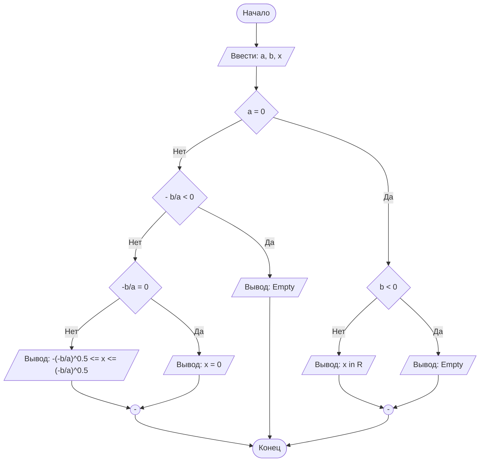

## Отчет по лабораторной работе № 1

#### № группы: ПМ-2602

#### Выполнил: Григорьева Екатерина

#### Вариант: 4

### Cодержание:

- [Постановка задачи](#1-постановка-задачи)
- [Входные и выходные данные](#2-входные-и-выходные-данные)
- [Математическая модель](#25-математическая-модель)
- [Выбор структуры данных](#3-выбор-структуры-данных)
- [Алгоритм](#4-алгоритм)
- [Программа](#5-программа)
- [Анализ правильности решения](#6-анализ-правильности-решения)

### 1. Постановка задачи

- Условие задачи

> Трое жильцов решили выбросить в контейнер объемом X литров мусорные пакеты объемом A, B, C литров соответственно. Они подходят к контейнеру в указанном порядке и пытаются поместить пакет в контейнер. Если пакет не помещается в контейнер, жилец уносит свой пакет в другое место. Скольким жильцам не удастся выкинуть мусор в указанный контейнер? На вход программы подаются натуральные числа X, A, B, C. 

- Для решения этой задачи необходимо создать переменную "контейнер" и складывать в нее пакеты ABC поочередно(условие).Если объем пакета +текущий объем контейнера не превышает объем бака (X) по условию, то пакет складывается в бак, если же пакет не влезает, то жилец уходит на другую мусорку и мы считаем его, так как в ответ надо указать количество жильцов ,которым не удастся выкинуть мусор.
  
**Пример:**
  Допустим X=11, A=10, B=3, C=1.Изначально бак пуст(0).Когда к баку подойдет жилец A, он сможет положить туда свой пакет(0+10=10,10<11).Следом прийдет жилец B с пакетом, объем которого равняется 3л .Жилец не сможет выбросить свой мусор.В контейнере получится 10+3=13л а вместимость бака всего 10л .Жилец В будет вынужден уйти.Следующий жилец С с мусором 1л сможет выбросить мешок в бак (10+1=11л).
Получается ответ для этого примера равняется 1. 

### 2. Входные и выходные данные

Уточните, что подается на вход (с обоснованием/рассуждением):

- какие типы данных (целые/вещественные числа/символы/строки);
- в каком количестве каждое (ограничение сверху/снизу);
- диапазон значений (min и max возможные значения);

Это про каждые входные данные. Затем - то же самое про выходные.

### 2,5. Математическая модель

Если нужно.

### 3. Выбор структуры данных

Анализ (рассуждения) и обоснования того, где и как Вы собираетесь хранить всё то,
что нужно для работы программы.

### 4. Алгоритм

На русском языке подробно расписать, что и в каком порядке делает Ваша программа.

В 1 лабораторной работе блок-схем обязательна. Ниже представлен пример с лекции,
реализованный с помощью `mermaid` - инструментом для рисования диаграмм и блок-схем.

```markdown
    ```mermaid
        ([Начало]) --> B[/Ввести: a, b, x/]
        B --> C{a = 0}
        C -- Нет --> D{- b/a < 0}
        D -- Нет --> E{"-b/a = 0"}
        E -- Нет --> F[/"Вывод: -(-b/a)^0.5 <= x <= (-b/a)^0.5"/]
        E -- Да --> G[/Вывод: x = 0/]
        D -- Да --> H[/Вывод: Empty/]
        C -- Да --> I{b < 0}
        I -- Нет --> J[/Вывод: x in R/]
        I -- Да --> K[/Вывод: Empty/]
        J --> M(("-"))
        K --> M
        G --> L(("-"))
        H ----> Z
        F --> L
        M --> Z
        L --> Z([Конец])
    ``` 
```




`Mermaid` нативно интегрирован в `GitHub`, а для работы в Вашей среде разработке - нужно установить
плагин: `File` > `Settings` > `Plugins`.


### 5. Программа

Полный текст программы с комментариями на русском языке

Нужно вставить код прямо в отчет в блок:

```markdown
    ```java
        class Main{
            // Что-то далее
        }
    ``` 
```

Это будет выглядеть следующим образом:

```java
class Main{
    // Что-то далее
}
```

### 6. Анализ правильности решения

Привести тесты и анализ работы программы для этих тестов.
Очень неплохо было бы обосновать выбор тестов.

1. Тест на что-то

- Input:
    ```
    1
    1
    ```

- Output:
    ```
    2
    ```

2. Тест на что-то еще

- Input:
    ```
    1
    -1
    ```

- Output:
    ```
    0
    ```

# Критерии оценивания

Обратите внимание на то, что лабораторная работа должна быть выложена в отдельный репозиторий с названием LabN (N -
Номер лабы). В репозитории должно быть минимум 2 файла (README.md - отчет, Main.java - код лабы)

