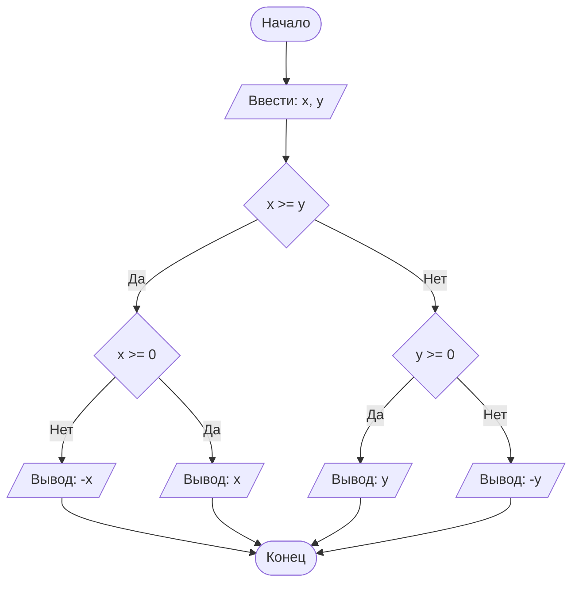

## Отчет по лабораторной работе № 1

#### № группы: ПМ-2602

#### Выполнила: Григорьева Екатерина

#### Вариант: 4

### Cодержание:

- [Постановка задачи](#1-постановка-задачи)
- [Входные и выходные данные](#2-входные-и-выходные-данные)
- [Выбор структуры данных](#3-выбор-структуры-данных)
- [Алгоритм](#4-алгоритм)
- [Программа](#5-программа)
- [Анализ правильности решения](#6-анализ-правильности-решения)

### 1. Постановка задачи

- Условие задачи

> Трое жильцов решили выбросить в контейнер объемом X литров мусорные пакеты объемом A, B, C литров соответственно. Они подходят к контейнеру в указанном порядке и пытаются поместить пакет в контейнер. Если пакет не помещается в контейнер, жилец уносит свой пакет в другое место. Скольким жильцам не удастся выкинуть мусор в указанный контейнер? На вход программы подаются натуральные числа X, A, B, C. 

- Для решения этой задачи необходимо создать переменную "контейнер" и складывать в нее пакеты ABC поочередно(условие).Если объем пакета +текущий объем контейнера не превышает объем бака (X) по условию, то пакет складывается в бак, если же пакет не влезает, то жилец уходит на другую мусорку и мы считаем его, так как в ответ надо указать количество жильцов ,которым не удастся выкинуть мусор.
  
**Пример:**
  Допустим X=11, A=10, B=3, C=1.Изначально бак пуст(0).Когда к баку подойдет жилец A, он сможет положить туда свой пакет(0+10=10,10<11).Следом прийдет жилец B с пакетом, объем которого равняется 3л .Жилец не сможет выбросить свой мусор.В контейнере получится 10+3=13л а вместимость бака всего 10л .Жилец В будет вынужден уйти.Следующий жилец С с мусором 1л сможет выбросить мешок в бак (10+1=11л).
Получается ответ для этого примера равняется 1. 

### 2. Входные и выходные данные

#### Данные на вход

На вход программа получает 4 натуральных числа.Натуральное число:(1,2,3...)Min значением является 1 ,так как это самое маленькое натуральное число.Max значением будет 2<sup>31</sup>-1 ,потому что тип int, в котором я храню свои переменные занимает 32 бита(1 из которых знаковый) и -1 комбинация(0).

|             | Тип               | min значение  | max значение     |
|-------------|-------------------|---------------|------------------|
| X (Число 1) | натуральное число |       1       | 2<sup>31</sup>-1 |
| A (Число 2) | натуральное число |       1       | 2<sup>31</sup>-1 |
| B (Число 3) | натуральное число |       1       | 2<sup>31</sup>-1 |
| C (Число 4) | натуральное число |       1       | 2<sup>31</sup>-1 |

#### Данные на выход

На выход мы получим 1 целое неотрицательное  число , не превышающее 3.Так как к нам всего приходят 3 жильца ,соответсвенно максимальное значение 3 ,а минимальное 0, если все жильцы смогут выбросить свой мусор.

|         | Тип                                | min значение | max значение|
|---------|------------------------------------|--------------|-------------|
| Число 1 | Целое неотрицательное число        | 0            |      3      |

### 3. Выбор структуры данных

Программа получает 4 натуральных числа. Поэтому для их хранения
можно выделить 4 переменных (`x`,`а`,`b`,`c`) типа `int`.Double для вещественных чисел, для большей точности ,он занимает много места(8 байт).В конкретной задаче лучше использовать int , он меньше по размеру(4 байта) и для натуральных чисел его хватит.

|             | название переменной | Тип (в Java) | 
|-------------|---------------------|--------------|
| X (Число 1) | `X`                 | `int`        |
| A (Число 2) | `A`                 | `int`        | 
| X (Число 3) | `B`                 | `int`        |
| Y (Число 4) | `C`                 | `int`        | 

Так же создаются 2 переменных("счетчика") типа int .Одна из этих переменных хранит ответ на задачу. 

### 4. Алгоритм

На русском языке подробно расписать, что и в каком порядке делает Ваша программа.




### 5. Программа

```java
import java.io.PrintStream;
import java.util.Scanner;

public class Main {
    // Объявляем объект класса Scanner для ввода данных
    public static Scanner in = new Scanner(System.in);
    // Объявляем объект класса PrintStream для вывода данных
    public static PrintStream out = System.out;

    public static void main(String[] args) {
        // вводим 4 натуральных числа
        int X = in.nextInt(); // вместимость контейнера
        int A = in.nextInt(); // мусорный пакет 
        int B = in.nextInt(); // мусорный пакет
        int C = in.nextInt(); // мусорный пакет

        // используем условный оператор для решения
        int zapolnennysorom = 0; // наполненность контейнера
        int neydachniki = 0;     // люди, которым пришлось шагать до следующей мусорки
        // проверяем текущий объем контейнера+новый мешок, если нам хватает объема контейнера, то человек выбрасывает мусор и к текущему объем добавляется новый мусор иначе человек уходит на другую мусорку,а мы увеличиваем наш счетчик на 1
        if (zapolnennysorom + A <= X) { 
            zapolnennysorom += A; // ура!!! выбросили мусор
        } else {
            neydachniki += 1;     // не повезло, пакет не поместился
        }

        // повторяем с оставшимися пакетами
        if (zapolnennysorom + B <= X) {
            zapolnennysorom += B; // ура!!! выбросили мусор
        } else {
            neydachniki += 1;     // не повезло, пакет не поместился
        }

        if (zapolnennysorom + C <= X) {
            zapolnennysorom += C; // ура!!! выбросили мусор
        } else {
            neydachniki += 1;     // не повезло, пакет не поместился
        }

        out.println(neydachniki);//выводим ответ на экран
    }
}
```

### 6. Анализ правильности решения

Привести тесты и анализ работы программы для этих тестов.
Очень неплохо было бы обосновать выбор тестов.

1. Тест на что-то

- Input:
    ```
    1
    1
    ```

- Output:
    ```
    2
    ```

2. Тест на что-то еще

- Input:
    ```
    1
    -1
    ```

- Output:
    ```
    0
    ```
